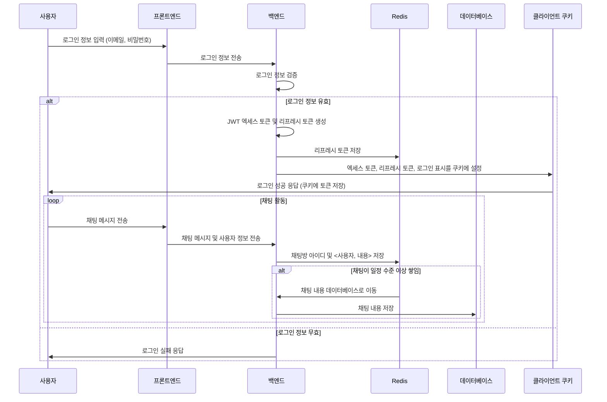

# Stalk - View Stock, Talk Everyone
<br />
<br />
<br />
<br />

<br />
<br />
<br />
<br />

## 프로젝트 기획 의도
<br />
이 프로젝트의 목표는 사용자가 산재되어 있는 주식 정보를 집중적으로 확인할 수 있는 "실시간 주식 정보 통합 플랫폼"을 구축하는 것입니다. <br />
파이썬을 이용해 주식 정보와 뉴스를 수집하고, 네이버 주식 게시판을 분석하여 사용자가 여론을 정확히 파악할 수 있도록 하였습니다. <br />
또한, 게시판과 실시간 채팅 기능을 통해 사용자들이 얻은 정보를 바탕으로 의견을 교류할 수 있게 하였습니다. <br />
이러한 통합적인 정보와 의견 교류를 바탕으로 사용자가 거래 결정을 내릴 수 있도록 돕는 것이 이 프로젝트의 기획 의도입니다.<br />


---


<br />
<br />

## Tech Stack

#### Frontend


#### Backend


#### Database


#### Deploy


---

<br />
<br />


## 기능 요약 (수정필)


---

<br />
<br />


## 팀원 구성
<br />

| 유경우 |
|:---:|
|  |
| [GitHub](https://github.com/ryukyungwoo) |


---

<br />
<br />

## 진행 일정

#### 2023년 7월 1일 → 2023년 7월 31일

```markdown

| 구분               | 1주차   | 2주차   | 3주차   | 4주차   |
|-------------------|:------:|:-------:|:------:|:------:|
| 기획 및 초기설정 구축 |   ✅   |        |       |          |
| 구현               |        |   ✅   |   ✅  |   ✅    |
| 점검               |        |        |        |   ✅    |
| 발표 준비           |        |        |        |   ✅    |


```
1주차 : 프로젝트의 초기 설정 및 서비스 기획 시작. <br />
2 ~ 4주차 : 주된 구현 기간으로, 프로젝트의 핵심 부분을 개발.<br />
4주차 : 최종 점검을 실시하여 프로젝트를 마무리. <br />
4주차 : 발표 준비와 최종 발표. <br />


---


<br />
<br />

## 업무 관리 (수정필)

<details>
<summary>업무의 명확한 파악</summary>
<br />
 

<br />
여기에는 Success Criteria, To-Do 리스트, 중요도, 도메인 등을 구분하여,<br />

작성된 업무의 목표가 무엇인지 명확하게 하였습니다
<br />


</details>
<br />

<details>
<summary>작업의 우선순위 및 진행 상태 관리</summary>
<br />
 

<br />
할 일 목록이 우선순위별로(P1, P2, P3, P4 등) 분류되어 있고, <br />
각각의 작업에 대한 진행 상태(예: '진행 중', '대기 중', '완료' 등)가 표시되어 있어 작업의 중요성과 긴급성을 한눈에 파악할 수 있습니다. <br />
이렇게 하여 가장 중요한 작업에 집중하고, 자원을 효과적으로 배분하며, 프로젝트의 진행을 효율적으로 관리할 수 있었습니다. <br />


</details>
<br />

<details>
<summary>도메인 별 작업 관리</summary>
<br />
 


<br />
할 일 목록을 도메인 마다 볼 수 있게 하였고,<br />
각각의 도메인에 대한 진척 정도를 한눈에 볼 수 있게 하였습니다.<br />
이렇게 하여 작업들을 스테이터스에 따라 도메인에 따라 집중 할 수 있도록 하여 업무의 관리성을 높혔습니다.<br />


</details>
<br />

<br />
<br />

## 프로젝트 기능 설명 (수정필)


<details>
<summary><strong>메인화면</strong></summary>
 <br />


메인 화면에서는 주식의 메타데이터를 볼 수 있습니다. 우측에 있는 메인 채팅방에서 채팅을 할 수 있으며, 우측 상단에는 로그인을 위한 버튼이 있습니다.

</details>

<details>
<summary><strong>주식 메타데이터 리스트</strong></summary>
 <br />


주식의 OVCA를 한눈에 볼 수 있으며, 각각의 속성에 따라 오름차순, 내림차순 등으로 정렬해서 볼 수 있습니다.

</details>

<details>
<summary><strong>주식 여론 리스트</strong></summary>
 <br />


네이버 주식 게시판을 크롤링해 여론을 분석한 후 수치적으로 볼 수 있게 했습니다. 각 속성에 따라 오름차순, 내림차순 등으로 정렬해서 볼 수 있습니다.

</details>

<details>
<summary><strong>각 주식의 메인 화면</strong></summary>
 <br />


주식의 메인 화면에서는 다양한 정보를 볼 수 있습니다. 가운데는 현재 들어와 있는 주식방의 이름이 있고, 그 아래로 현재 주식의 가격 데이터, 뉴스와 게시판, 우측 상단에는 주식 채팅방이 있습니다.

</details>

<details>
<summary><strong>주식 가격데이터 차트</strong></summary>
 <br />


피리어드로 가격 데이터의 범위를 설정할 수 있고, 인터벌로 가격 데이터의 단위를 설정할 수 있습니다. 마우스를 호버링하면 차트의 OVCA를 보여줍니다.

</details>

<details>
<summary><strong>주식 관련 뉴스 리스트</strong></summary>
 <br />


각 항목당 뉴스로 하이퍼링크 되어 있어 원문을 볼 수 있습니다.

</details>

<details>
<summary><strong>주식 관련 게시판</strong></summary>
 <br />


일반적인 CRUD 게시판으로 덧글을 달 수 있게 하여 의견 교환을 할 수 있도록 하였습니다. 로그인과 비로그인 상황에 나누어 로그인 시 닉네임과 비밀번호가 자동으로 매핑되도록 하였습니다.

</details>

<details>
<summary><strong>주식 채팅방</strong></summary>
 <br />


주식마다 채팅룸이 나뉘어져 있어 관련 주식에 관한 채팅을 할 수 있도록 하였습니다.

</details>


---


<br />
<br />


## 시퀀스 다이어그램 예시





<details>
<summary><strong>로그인 및 채팅 과정 예시</strong></summary>

<br />

상기의 시퀀스 다이어그램은 사용자가 시스템을 통해 로그인을 하고, 채팅 하는 과정을 단계별로 나타낸 것입니다. 


- **로그인 과정**
    - 사용자가 로그인 정보를 입력하고 프론트엔드를 통해 백엔드로 전송합니다.
    - 백엔드에서는 전송받은 로그인 정보의 유효성을 검증합니다.

- **토큰 생성 및 저장**
    - 정보가 유효하면 JWT 엑세스 토큰과 리프레시 토큰을 생성합니다.
    - 생성된 리프레시 토큰은 레디스에 저장되고, 쿠키에 엑세스 토큰, 리프레시 토큰, 로그인 표시를 설정합니다.

- **채팅 활동**
    - 로그인 성공 후 사용자는 채팅 메시지를 전송할 수 있습니다.
    - 전송된 채팅 메시지는 사용자 정보와 함께 백엔드로 전송되며, 백엔드에서는 채팅방 아이디와 <사용자, 내용>을 레디스에 저장합니다.

- **채팅 내용의 저장 및 이동**
    - 채팅이 일정 수준 이상 쌓이면, 레디스에 저장된 채팅 내용은 데이터베이스로 이동하여 저장됩니다.


</details>

---


<br />
<br />


## 백엔드 계층 구조

<details>
    
```markdown
src
─main
├─java
│ └─kr
│ └─eddi
│ └─demo
│ ├─config
│ ├─domain
│ │ ├─account
│ │ │ ├─controller
│ │ │ │ └─form
│ │ │ ├─entity
│ │ │ ├─repository
│ │ │ └─service
│ │ │ └─request
│ │ ├─board
│ │ │ ├─controller
│ │ │ │ └─form
│ │ │ ├─entity
│ │ │ ├─repository
│ │ │ └─service
│ │ ├─chat
│ │ │ ├─controller
│ │ │ ├─entity
│ │ │ ├─repository
│ │ │ └─service
│ │ ├─stock
│ │ │ ├─controller
│ │ │ ├─entity
│ │ │ ├─repository
│ │ │ └─service
│ ├─initializer
│ ├─scheduler
│ └─util
│ └─jwt
│ └─redis
└─resources
└─templates
```

도메인별 구분을 통해 각 기능과 책임을 명확히 하여 객체 지향 설계를 강화했습니다.  <br />
컨트롤러, 서비스, 레포지토리를 각 도메인별로 분리함으로써 캡슐화와 응집도를 높이고, 코드의 가독성과 유지보수성을 향상시켰습니다.  <br />
또한, 스케쥴러나 이니셜라이즈 같은 경우 필요한 의존성을 주입하여 애플리케이션의 로직을 분리하고 관리하기 쉽게 만들었고, <br />
유지 보수성과 확장성을 향상 시켰습니다. <br />


</details>

---


<br />
<br />


## 주요 API Spec

<details>
<summary><strong>사용자 로그인 - POST /account/sign-in</strong></summary>

<br />

- **HTTP Method**: `POST`
- **URL**: `/account/sign-in`
- **BODY (요청 데이터)**:
  ```json
  {
    "email": "user@example.com",
    "password": "your_password"
  }
  ```
- **Response Parameters (Response Sample)**:
  ```json
  {
    "refreshTokenExpires": "2024-03-28T12:00:00Z"
  }
  ```
  로그인이 성공할 경우, `refreshTokenExpires` 값이 반환됩니다.
  이는 리프레시 토큰의 만료 시간을 나타냅니다.
- **Result Code**:
  - `200 OK` for success
  - `400 Bad Request` for invalid request (예: 존재하지 않는 이메일 또는 잘못된 비밀번호 입력)

</details>

<details>
<summary><strong>게시판 글 등록 - POST /board/register/{ticker}</strong></summary>

<br />

- **HTTP Method**: `POST`
- **URL**: `/board/register/{ticker}`
- **Path Variable**: 
  - `{ticker}`: 주식의 티커를 나타냅니다. 글이 등록될 주식을 지정합니다.
- **BODY (요청 데이터)**:
  ```json
  {
    "title": "게시글 제목",
    "content": "게시글 내용",
    "writer": "익명 작성자",
    "nickname": "사용자 닉네임",
    "password": "게시글 비밀번호"
  }
  ```
  `writer` 필드는 익명 사용자가 글을 작성할 경우 사용하며, `nickname`은 로그인한 사용자가 글을 작성할 경우 사용됩니다.
  둘 중 하나만 사용되어야 합니다.
  `password`는 글에 접근하기 위한 비밀번호로, 필요한 경우 설정할 수 있습니다.
- **Response Parameters (Response Sample)**:
  ```json
  {
    "id": 1,
    "ticker": "AAPL"
  }
  ```
  게시글 등록에 성공하면 등록된 게시글의 ID와 티커가 반환됩니다.
- **Result Code**:
  - `200 OK` for success
  - `400 Bad Request` for invalid request (예: 존재하지 않는 주식 티커, 필수 필드 누락 등)

</details>

<details>
<summary><strong>채팅 메시지 전송 - WebSocket /chat/{ticker}</strong></summary>

<br />

- **WebSocket URL**: `/chat/{ticker}`
- **Path Variable**: 
  - `{ticker}`: 주식의 티커를 나타냅니다. 채팅이 발생할 주식 채팅방을 지정합니다.
- **요청 데이터**: 
  - 채팅 메시지 내용을 `String` 형식으로 전송합니다.
- **동작 설명**:
  - 사용자가 채팅 메시지를 전송하면, 서버는 해당 메시지를 주식 티커에 해당하는 채팅방의 모든 클라이언트에게 전달합니다.
  - 로그인한 사용자는 닉네임과 메시지 내용이 함께 전송됩니다.
  - 익명 사용자는 "익명"과 클라이언트 IP의 앞 세 세그먼트가 포함된 형식으로 메시지가 전송됩니다.
  - 전송된 메시지는 Redis에 저장되며, 일정 수준 이상 쌓이면 데이터베이스로 이전됩니다.
- **응답 데이터**:
  - 클라이언트는 해당 채팅방에서 다른 사용자가 전송한 메시지를 실시간으로 수신할 수 있습니다.
  - 메시지 형식은 `[닉네임 또는 "익명" + IP]: 메시지 내용`입니다.

</details>


<details>
<summary><strong>주식 여론 목록 조회 - GET /stock/opinion-list/{sortItem}/{ascending}/{pageNumber}</strong></summary>

<br />

- **HTTP Method**: `GET`
- **URL**: `/stock/opinion-list/{sortItem}/{ascending}/{pageNumber}`
- **Path Variables**: 
  - `{sortItem}`: 정렬 기준이 되는 항목입니다. 예를 들어, 긍정적 의견 수, 부정적 의견 수 등을 지정할 수 있습니다.
  - `{ascending}`: 정렬 방식을 나타냅니다. `asc`는 오름차순, `desc`는 내림차순입니다.
  - `{pageNumber}`: 조회할 페이지 번호입니다. 1부터 시작합니다.
- **BODY (요청 데이터)**: 요청 본문이 없습니다.
- **Response Parameters (Response Sample)**:
  ```json
  [
    {
      "ticker": "주식 티커",
      "stockName": "주식 이름",
      "positiveCount": 긍정적 의견 수,
      "negativeCount": 부정적 의견 수,
      "naturalCount": 중립적 의견 수,
      "totalSentimentScore": 총 감정 점수
    },
    {
      "ticker": "다른 주식 티커",
      "stockName": "다른 주식 이름",
      "positiveCount": 다른 긍정적 의견 수,
      "negativeCount": 다른 부정적 의견 수,
      "naturalCount": 다른 중립적 의견 수,
      "totalSentimentScore": 다른 총 감정 점수
    }
  ]
  ```
  - 이 응답은 지정된 정렬 기준과 방식, 페이지 번호에 따라 필터링된 주식 여론 목록을 반환합니다.
- **Result Code**:
  - `200 OK` for success: 성공적으로 주식 여론 목록을 조회하였습니다.
  - `400 Bad Request` for invalid request: 잘못된 요청입니다. 예를 들어, 존재하지 않는 티커, 잘못된 페이지 번호 등이 있습니다.

</details>


---
